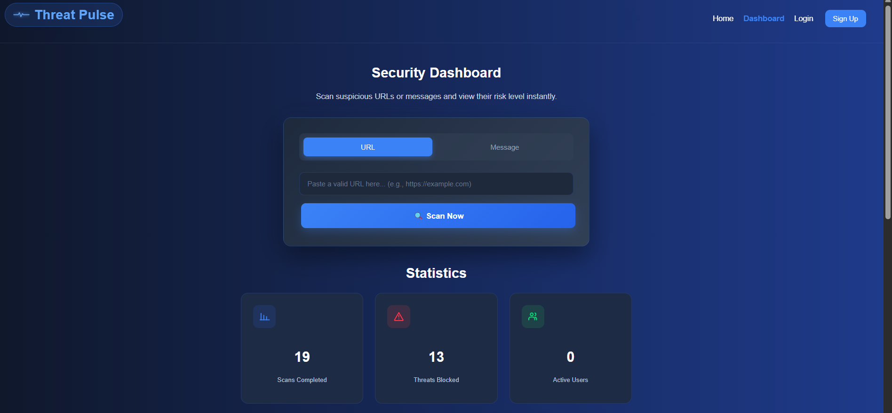
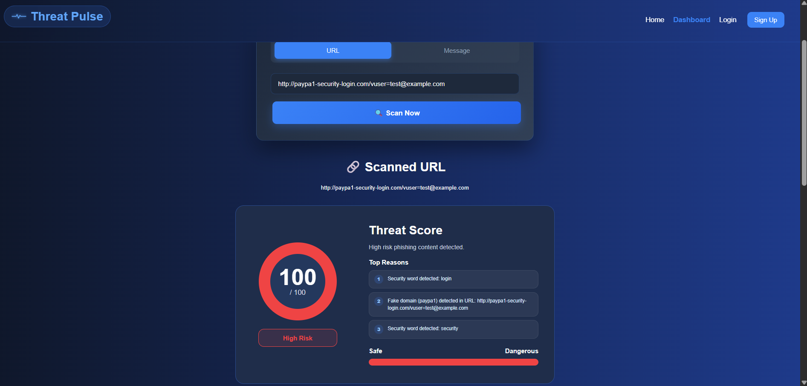
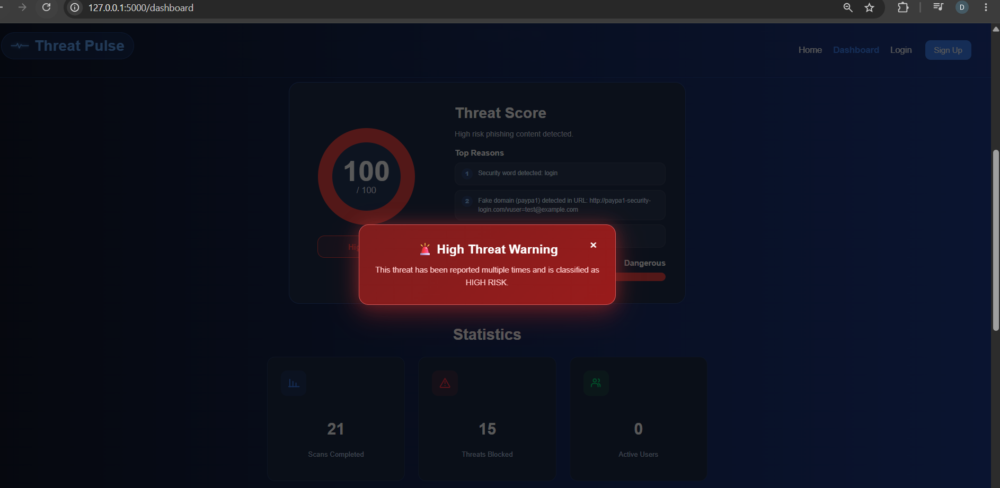

# 🛡️ Threat Pulse

A lightweight web-based phishing detection platform that analyzes suspicious URLs and messages using rule-based detection techniques. The system classifies threats into different risk levels and provides an interactive dashboard for monitoring security events.

---

# 📖 Overview

Threat Pulse is a cybersecurity project developed using **Python**, **Flask**, **SQLite**, **HTML**, **CSS**, and **JavaScript**.

The application helps users detect phishing attempts by analyzing URLs and text messages for common phishing indicators such as suspicious keywords, fake domains, shortened links, insecure protocols, and social engineering patterns.

After each scan, the system calculates a risk score and classifies the result as **Safe**, **Medium Risk**, or **High Risk**.

---

# ✨ Features

- 🔍 Analyze suspicious URLs
- 💬 Analyze suspicious text messages
- 🛡️ Rule-based phishing detection
- 📊 Risk score calculation
- 🚨 Threat classification
- 📈 Interactive security dashboard
- 📜 Recent scan history
- 💾 SQLite database
- ⚡ Fast real-time analysis

---

# 🖼️ Screenshots

## Dashboard



---

## Threat Analysis



---

## Analysis Result



---

# 📂 Project Structure

```text
Threat-Pulse/
│
├── app.py
├── analyzer.py
├── database.py
├── requirements.txt
├── README.md
│
├── templates/
│   ├── dashboard.html
│   ├── login.html
│   └── register.html
│
├── static/
│   ├── style.css
│   └── script.js
│
└── images/
    ├── dashboard-home.png
    ├── threat-analysis.png
    └── Second-analysis.png
```

---

# ⚙️ Technologies Used

- Python
- Flask
- SQLite
- HTML5
- CSS3
- JavaScript
- Regular Expressions (Regex)

---

# 🔍 Detection Method

Threat Pulse uses a rule-based detection engine that evaluates URLs and messages based on multiple phishing indicators.

### URL Indicators

- HTTP instead of HTTPS
- Suspicious keywords
- URL shorteners
- Fake domains
- Long URLs
- Multiple subdomains
- Special characters
- Suspicious symbols

### Message Indicators

- Urgent language
- Verification requests
- Password requests
- Banking keywords
- Account suspension messages
- Prize and reward scams

Each detected indicator increases the overall risk score.

---

# 🚦 Risk Levels

| Score | Risk Level |
|-------|------------|
| 0 – 29 | 🟢 Safe |
| 30 – 59 | 🟡 Medium Risk |
| 60+ | 🔴 High Risk |

---

# 🚀 Installation

Clone the repository

```bash
git clone https://github.com/DimaSec04/Threat-Pulse.git
```

Move into the project folder

```bash
cd Threat-Pulse
```

Install dependencies

```bash
pip install -r requirements.txt
```

Run the application

```bash
python app.py
```

Open your browser

```
http://127.0.0.1:5000
```

---

# 🎯 Future Improvements

- Machine Learning detection
- VirusTotal API integration
- Email phishing detection
- PDF report generation
- User authentication improvements
- Threat intelligence feeds
- Advanced dashboard analytics

---

# 👩‍💻 Author

**Dima Raaed**

Cybersecurity Student

GitHub:

https://github.com/DimaSec04

---

# 📄 License

This project was developed for educational and learning purposes.
